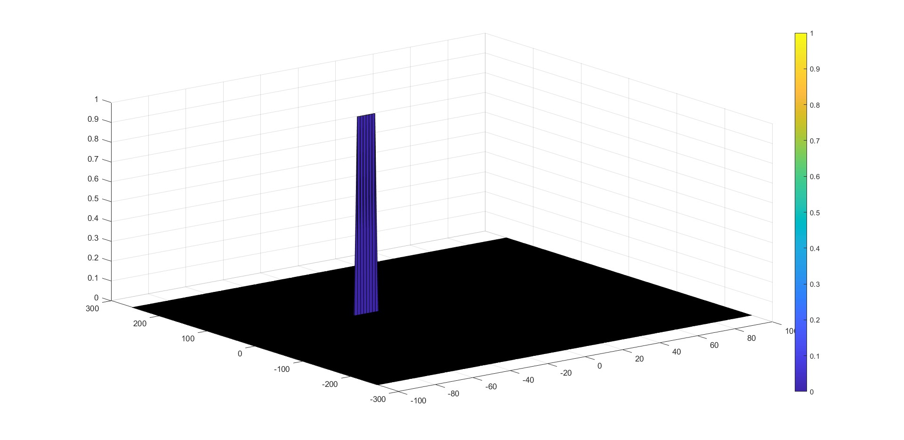

# Radar_Target_Generation_Detection

## Description

This project is introduced for Udacity Sensor Fusion Nanodegreed.


To achieve this project, following tasks need to be implemented:

>- Configure the FMCW waveform based on the system requirements.
>- Define the range and velocity of target and simulate its displacement.
>- For the same simulation loop process the transmit and receive signal to determine the beat signal
>- Perform Range FFT on the received signal to determine the Range
>- Perform the CFAR processing on the output of 2nd FFT to display the target.

## Results




## Implementation details

### Implementation steps for the 2D CFAR process.

The CFAR (Constant False Alarm Rate) allows to determine a dynamic threshold based on Signal Noise Ratio in a giveN 2D signal window (CUT: cell under test)

The steps to compute the CFAR, are as follows:

>- Determine the number of Training cells for each dimension. Similarly, pick the number of guard cells.
>- Slide the cell under test across the complete matrix. Make sure the CUT has margin for Training and Guard cells from the edges.
>- For every iteration sum the signal level within all the training cells. To sum convert the value from logarithmic to linear using db2pow function.
>- Average the summed values for all of the training cells used. After averaging convert it back to logarithmic using pow2db.
>- Further add the offset to it to determine the threshold.
>- Next, compare the signal under CUT against this threshold.
>- If the CUT level > threshold assign it a value of 1, else equate it to 0.

Such sliding window operation, can also be expressed as Convolution operations, but for conveniency and ease to read we took the standard for loop approach.

```
for range_idx = Tr + Gr + 1 : Nr/2 - Tr - Gr
    for doppler_idx = Td + Gd + 1 : Nd - Td - Gd
        
        % ...
        % ... calculate threshold for this CUT
        % ...
        
        if RDM(range_idx, doppler_idx) > threshold
            CFAR(range_idx, doppler_idx) = 1;
        end
    end
end
```


### Training Cells and Guard Cells selection

The selected values for cells are:
>- Training cells: RangeDoppler(8, 2)
>- Gurad cells: RangeDoppler(2, 1) 

Thos values were hand selected with a priority to Range axis with higher Training range (8 - 2 = 6) than for Doppler axis(2 - 1=1). Due to RDM, those values gives a tradeoff between enough precision (smaller guard cells) and robustness larger training area.

These configuration gives us a total of 14 guard cells and 132 training cells. Ratio Training_Cells/Guard_Cells = 9.42.

### Offset Selection

The offset selection were a manual iterative process. The tested values were 10, 12 and as used in final results 14.
With the first offset(10), image below, the CFAR created to much false positives.

On the second try, with the offset of 12, we observe only a unique false positive.


### Steps taken to suppress the non-thresholded cells at the edges.

As defined on the project description for 2D CFAR
>- If the CUT level > threshold assign it a value of 1, else equate it to 0

We take the approach of create a CFAR array filled with zeros of the RDM size. By dooing that, we only need to set the values when the CUT level > threshold. 
